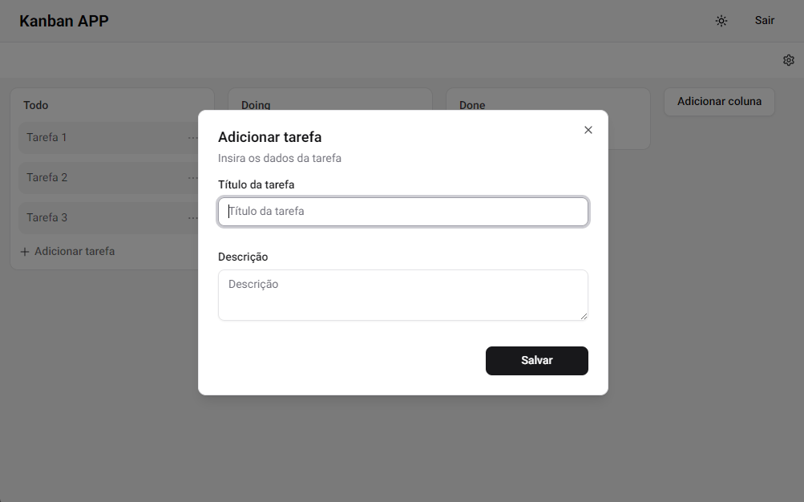
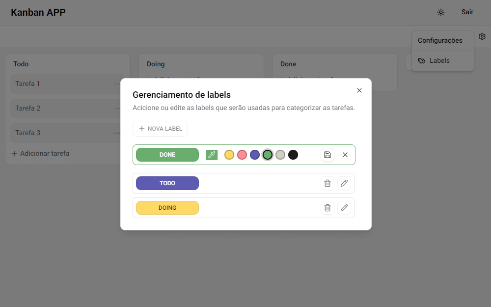

# 🧠 Next.js Kanban App

Este é um projeto de **Quadro Kanban multiusuário**, desenvolvido com tecnologias modernas do ecossistema React e Next.js. A aplicação permite o gerenciamento visual de tarefas com autenticação, suporte a temas e manipulação em tempo real do board.

> 🔗 Acesse a aplicação em produção: [https://nextjs-kanban-iota.vercel.app](https://nextjs-kanban-iota.vercel.app)

> Dados de login para teste:
_{ **Email:** guilhermanodev@gmail.com |
**Senha:** 123456 }_

## 🛠️ Tecnologias Utilizadas

- **Next.js 15 (App Router)**
- **TypeScript**
- **Tailwind CSS**
- **ShadCN UI** (base de componentes)
- **React Hook Form + Zod** (validação de formulários)
- **Prisma ORM** com banco de dados **PostgreSQL**
- **Supabase Auth** (auth + DB)

## Práticas de desenvolvimento

- ✅ Componentização com shadcn/ui
- ✅ Validação com Zod + React Hook Form
- ✅ Arquitetura modular e escalável
- ✅ Server components e server actions
- ✅ Integração com Supabase (Auth + DB)
- ✅ Deploy automatizado via Vercel
- ✅ Design responsivo com Tailwind

## 📁 Estrutura de pastas

```bash
src/
├─ app/                     # Rotas da aplicação (App Router)
│  ├─ (auth)/               # Rotas públicas (login, signup)
│  └─ (private)/kanban/     # Áreas privadas (autenticadas)
│
├─ components/              # Componentes compartilhados (UI, Theme)
├─ features/                # Domínios da aplicação (kanban, auth)
├─ hooks/                   # React custom hooks
├─ lib/                     # Libs auxiliares (supabase, types, prisma)
├─ constants/               # Constantes da aplicação
├─ prisma/                  # Schemas e migrações do banco
```

## 📸 Screenshots

#### 🔹 Quadro Kanban (Board)


#### 🔹 Modal para adicionar novo card


#### 🔹 Gerenciamento de etiquetas


## Proximos passos

> ⬜ Estado global com zustand\
> ⬜ Performance para grandes massas de dados no board\
> ⬜ Testes

## 👨‍💻 Autor

Desenvolvido por [Guilhermano Silva](https://github.com/guilhermanosilva)
